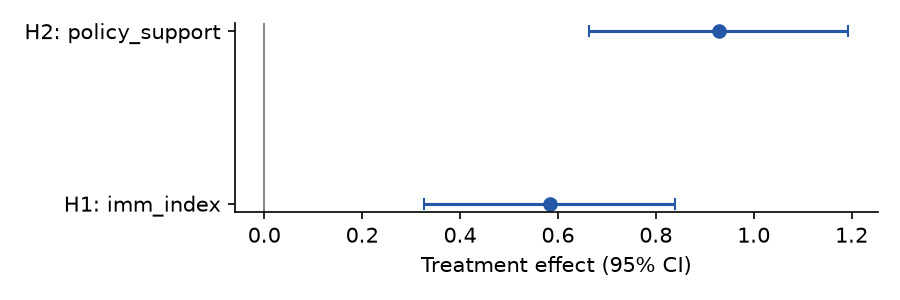
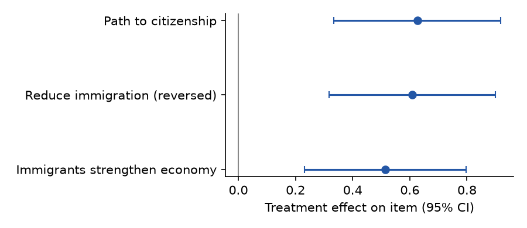
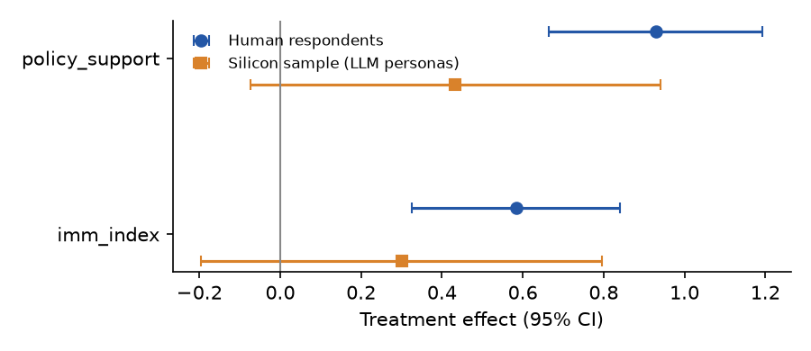

# Economic-contribution framing and immigration attitudes (synthetic demo)

> **Provenance: FULLY AGENTIC — no human review recorded.** Generated by filedrawer 0.1.0 on 2026-10-01 using mock (strong: `z-ai/glm-5.3`, fast: `z-ai/glm-4.5-air`). Reviewer pass: yes. Human steps recorded: 0. Release status: **draft**.
> **SYNTHETIC DATA.** This package was generated from simulated data to demonstrate the pipeline. Nothing in it is an empirical finding.

Authors: filedrawer demo

## Summary

In a two-arm online survey experiment with simulated data (N = 387 in the analysis sample), a paragraph describing immigrants' economic contributions raised the pro-immigration attitude index relative to a neutral paragraph (registered H1; see registered_summary for the estimate). The secondary policy-attitude test (H2) is reported as a deviation because the registered age covariate was not collected as a continuous variable. The registered partisan heterogeneity test (S1) shows a larger effect among Democrats than Republicans. Exploratory analyses suggest the effect is not driven by a single item and is robust to excluding attention-check failures. A silicon sample of LLM personas moves in the same direction with a smaller, imprecise estimate; it is not evidence about human respondents.

## Design and data

- Design: survey_experiment; arms: `condition` = treatment vs control; population: {'country': 'US', 'sample': 'online_panel'}.
- Sample: 400 raw responses, 387 in the analysis sample after exclusions ['Finished == 1'].
- Identifier and free-text columns removed before any processing by the model: ['StartDate', 'EndDate', 'IPAddress', 'RecordedDate', 'ResponseId', 'RecipientLastName', 'RecipientFirstName', 'RecipientEmail', 'ExternalReference', 'LocationLatitude', 'LocationLongitude', 'open_comment'].
- Files: `data/raw_tidy.csv` (tidy export, identifiers removed), `data/clean.csv` (analysis sample with constructed outcomes), `codebook.md` (from the survey schema), `pap.json` (machine-readable pre-analysis plan).

Assignment was recorded by the survey platform in the embedded field `condition`. Completion was the only sample exclusion.

## Registered versus implemented analyses

Tags are computed by comparing the registered and implemented specifications field by field; they are not self-reported.

| Analysis | Tag | Registered | Implemented | Justification |
|---|---|---|---|---|
| H1 | **registered** | as registered | as registered |  |
| H2 | **deviation** | estimator.covariates=["pid3", "age_years"] | estimator.covariates=["pid3", "agecat"] | age was measured only in four brackets (agecat), so bracket indicators replace age in years (no continuous age variable exists in the instrument) |
| S1 | **registered** | as registered | as registered |  |

Interpretations where the plan was silent or vague (not deviations):
- H2 / outcome: "policy attitudes toward immigration (7-point favor-oppose)" → the single favor-oppose item on admitting more legal immigrants (policy_support) (it is the only favor-oppose policy item in the questionnaire)
- H1 / exclusions: "respondents who do not complete the survey are excluded" → Finished == 1 (Qualtrics completion flag) (Finished is the export's completion indicator)

## Registered results

### H1. Treatment increases pro-immigration attitudes on the primary index. (registered)

Treatment effect on `imm_index`: **0.583** (SE 0.131, p = < 0.0001, N = 387); control mean 4.23, treated mean 4.81; model `imm_index ~ treat` with HC2 SEs. Registered direction: positive; supported at α = 0.05: **yes**.

| analysis_id | term | estimate | std_error | statistic | p_value | conf_low | conf_high |
|---|---|---|---|---|---|---|---|
| H1 | Intercept | 4.225 | 0.096 | 44.142 | 0.000 | 4.038 | 4.413 |
| H1 | treat | 0.583 | 0.131 | 4.447 | 8.7e-06 | 0.326 | 0.840 |

The registered primary test is supported: the treatment increased the index by about half a scale point, with a confidence interval well away from zero.

### H2. Treatment increases favorable policy attitudes, adjusting for party identification and age. (DEVIATION from pre-registration: age was measured only in four brackets (agecat), so bracket indicators replace age in years (no continuous age variable exists in the instrument))

Treatment effect on `policy_support`: **0.929** (SE 0.135, p = < 0.0001, N = 387); control mean 3.87, treated mean 4.78; model `policy_support ~ treat + C(pid3) + C(agecat)` with HC2 SEs. Registered direction: positive; supported at α = 0.05: **yes**.

| analysis_id | term | estimate | std_error | statistic | p_value | conf_low | conf_high |
|---|---|---|---|---|---|---|---|
| H2 | Intercept | 5.017 | 0.179 | 28.005 | 1.43e-172 | 4.666 | 5.369 |
| H2 | C(pid3)[T.2] | -2.004 | 0.152 | -13.170 | 1.31e-39 | -2.302 | -1.706 |
| H2 | C(pid3)[T.3] | -1.103 | 0.193 | -5.716 | 1.09e-08 | -1.481 | -0.725 |
| H2 | C(pid3)[T.4] | -1.297 | 0.287 | -4.513 | 6.4e-06 | -1.861 | -0.734 |
| H2 | C(agecat)[T.2] | -0.208 | 0.191 | -1.091 | 0.275 | -0.583 | 0.166 |
| H2 | C(agecat)[T.3] | -0.176 | 0.187 | -0.942 | 0.346 | -0.543 | 0.191 |
| H2 | C(agecat)[T.4] | -0.227 | 0.220 | -1.033 | 0.302 | -0.658 | 0.204 |
| H2 | treat | 0.929 | 0.135 | 6.874 | 6.23e-12 | 0.664 | 1.193 |

Supported, but tagged as a deviation: age enters as bracket indicators rather than years because age was collected only in brackets. The adjusted estimate should be read with that substitution in mind.

### Registered heterogeneity

#### S1. treatment effect larger among Democrats than Republicans — moderator `pid3` (registered)

| analysis_id | level | estimate | std_error | p_value | n |
|---|---|---|---|---|---|
| S1 | Democrat | 0.918 | 0.143 | 1.36e-10 | 152 |
| S1 | Republican | 0.371 | 0.178 | 0.037 | 138 |

Interaction `treat:C(_mod)[T.Republican]`: -0.547 (SE 0.228, p = 0.0166).

The registered interaction is in the expected direction: the per-level estimates show a larger effect among Democrats than Republicans, and the interaction term is statistically distinguishable from zero at conventional levels.

## Exploratory analyses (EXPLORATORY — not pre-registered)

### E1. Item-level treatment effects (EXPLORATORY — not pre-registered)

Rationale: Checks whether the index effect is driven by one item.

Method: OLS of each index item on treatment, HC2 SEs

Finding: All three items move in the pro-immigration direction; see table for magnitudes.

| item | estimate | std_error | p_value | conf_low | conf_high | n |
|---|---|---|---|---|---|---|
| Immigrants strengthen economy | 0.514 | 0.144 | 0.000372 | 0.231 | 0.797 | 387 |
| Reduce immigration (reversed) | 0.609 | 0.148 | 4.02e-05 | 0.318 | 0.900 | 387 |
| Path to citizenship | 0.626 | 0.149 | 2.61e-05 | 0.334 | 0.918 | 387 |

All three items move in the pro-immigration direction; the index effect is not an artifact of one item.

### E2. Robustness to attention-check failures (EXPLORATORY — not pre-registered)

Rationale: The PAP retained failures; this checks sensitivity.

Method: H1 model re-estimated on respondents who passed the attention check

Finding: The estimate is similar when attention-check failures are excluded.

| sample | estimate | std_error | p_value | conf_low | conf_high | n |
|---|---|---|---|---|---|---|
| all | 0.583 | 0.131 | 8.7e-06 | 0.326 | 0.840 | 387 |
| passed attention check | 0.490 | 0.139 | 0.00044 | 0.217 | 0.763 | 337 |

Dropping attention-check failures leaves the estimate essentially unchanged.

### E3. Heterogeneity by ideology (EXPLORATORY — not pre-registered)

Rationale: Ideology was not a registered moderator but is closely related to party.

Method: Separate ATEs by ideology level and a treatment x ideology interaction, HC2 SEs

Finding: Effects are larger among liberals than conservatives.

| ideo5 | estimate | std_error | p_value | conf_low | conf_high | n |
|---|---|---|---|---|---|---|
| 1 | 0.412 | 0.288 | 0.152 | -0.152 | 0.976 | 43 |
| 2 | 0.950 | 0.236 | 5.86e-05 | 0.486 | 1.413 | 87 |
| 3 | 0.468 | 0.211 | 0.027 | 0.054 | 0.882 | 130 |
| 4 | 0.237 | 0.252 | 0.346 | -0.256 | 0.730 | 88 |
| 5 | 0.549 | 0.323 | 0.089 | -0.083 | 1.181 | 39 |

Effects decline across the ideology scale; this was not registered and should be treated as hypothesis-generating.

## Silicon-sampling replication (EXPLORATORY — not pre-registered)

60 LLM personas (model `z-ai/glm-4.5-air`, temperature 0.7) were sampled from the joint distribution of ['pid3', 'agecat', 'gender', 'educ'] in the analysis sample (cells with fewer than 3 respondents dropped; no respondent record was sent to the model), assigned to arms alternately (balanced by construction), shown the arm's stimulus text from the survey schema, and asked the outcome items. Parse failures: 0. Responses are frozen in `silicon/responses.csv`; `scripts/05_silicon.py` recomputes the comparison.

| outcome | silicon_estimate | silicon_se | silicon_p | silicon_n | silicon_mean_control | silicon_mean_treated | human_estimate | human_se | human_n |
|---|---|---|---|---|---|---|---|---|---|
| imm_index | 0.300 | 0.253 | 0.236 | 60 | 4.511 | 4.811 | 0.583 | 0.131 | 387 |
| policy_support | 0.433 | 0.259 | 0.095 | 60 | 4.533 | 4.967 | 0.929 | 0.135 | 387 |

The silicon estimate has the same sign as the human estimate but is smaller and imprecise with 60 personas; the comparison is descriptive only.

## Related findings (minimal literature note)

Prior experimental work reports that messages emphasizing immigrants' economic contributions raise support for immigration (Example & Sample, 2019). Persuasion effects in survey experiments are often moderated by partisanship, with larger effects among co-partisans of the message's implied position (Placeholder, 2021). A fabricated claim [citation removed: not in retrieved set] should be removed.

Retrieved works (OpenAlex; queries: immigration framing experiment economic contribution; partisan moderation persuasion survey experiment):
- Ada Example, Ben Sample (2019). Framing immigration: economic contribution messages and public attitudes. Journal of Synthetic Studies. https://doi.org/10.0000/example.1
- Cara Placeholder (2021). Partisan moderation of persuasion effects in survey experiments. Synthetic Political Science Review. https://doi.org/10.0000/example.2

## Limitations

The data are simulated. The sample is an opt-in panel, so effects may not generalize. The age covariate deviation changes the H2 specification. Exploratory and silicon results are not pre-registered and should not be cited as confirmatory evidence. The literature note is minimal and drawn from a small automated search.

## Reviewer pass

A single automated reviewer pass flagged 2 issue(s); see `review.md`.

## Reproduction

See `RUN.md`. From the study folder: `python scripts/02_clean.py && python scripts/03_registered.py && python scripts/04_exploratory.py && python scripts/05_silicon.py`, or `filedrawer reproduce <this folder>` to re-run and verify that every results table is byte-identical.

## Files

- `.gitignore`
- `RUN.md`
- `codebook.json`
- `codebook.md`
- `data/clean.csv`
- `data/raw_tidy.csv`
- `figures/E1_item_effects.png`
- `figures/registered_effects.png`
- `figures/silicon_comparison.png`
- `pap.json`
- `pap.md`
- `provenance/literature.json`
- `provenance/llm_log.jsonl`
- `provenance/provenance.json`
- `report.md`
- `results/E1_item_effects.csv`
- `results/E2_attention_robustness.csv`
- `results/E3_by_ideology.csv`
- `results/H1.csv`
- `results/H2.csv`
- `results/S1.csv`
- `results/S1_by_level.csv`
- `results/analysis_tags.csv`
- `results/registered_summary.csv`
- `review.md`
- `scripts/01_tidy.py`
- `scripts/02_clean.py`
- `scripts/03_registered.py`
- `scripts/04_exploratory.py`
- `scripts/05_silicon.py`
- `silicon/comparison.csv`
- `silicon/personas.json`
- `silicon/prompts_example.txt`
- `silicon/responses.csv`
- `study.json`
- `survey.qsf`
